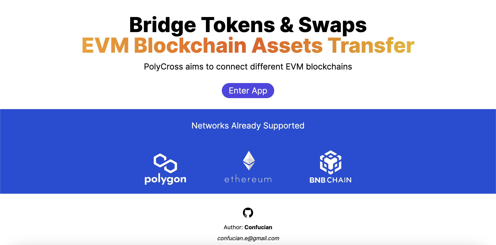
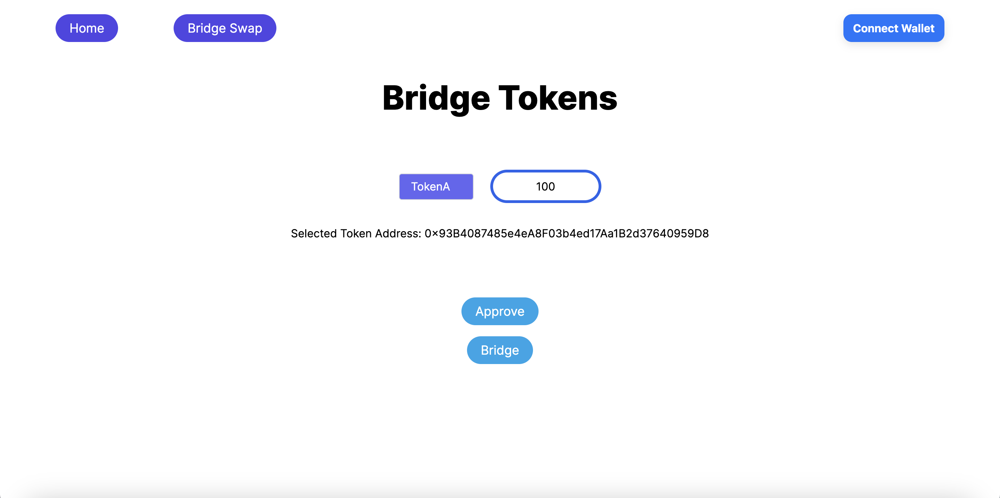
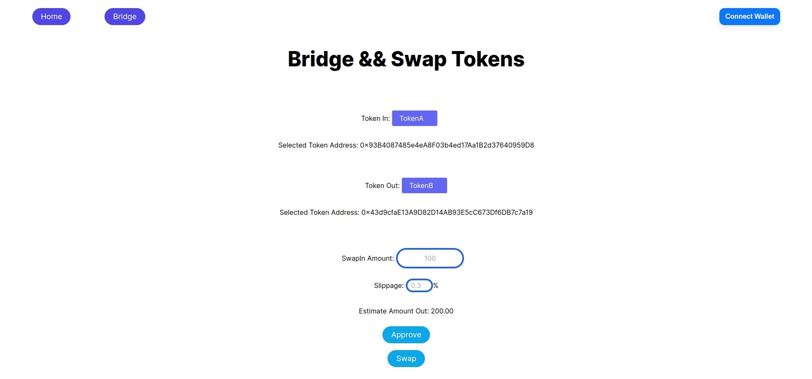

# Introduction

This is the front end of the **PolyCross** which is a [Next.js](https://nextjs.org/) project bootstrapped with [`create-next-app`](https://github.com/vercel/next.js/tree/canary/packages/create-next-app).

## Screenshot

Home Page



Bridge Page



Bridge Swap Page



## Build

First, clone the repo to localhost:

```bash
git clone https://github.com/PolyCross/frontend.git
```

Second, install the dependencies:

```bash
yarn install
```

Then, run the development server:

```bash
yarn dev
```

Open [http://localhost:3000](http://localhost:3000) with your browser to see the result.

## Acknowledgements

- Thanks to [Next.js](https://nextjs.org/) and [Tailwind CSS](https://tailwindcss.com/) for providing comprehensive documentation that helped a beginner like me quickly get started with development.
- Thanks to [Wagmi](https://wagmi.sh/) and [Viem](https://viem.sh/) for these two excellent interaction libraries.
- Special thanks to [Vercel](https://vercel.com/) for providing free website hosting services.
